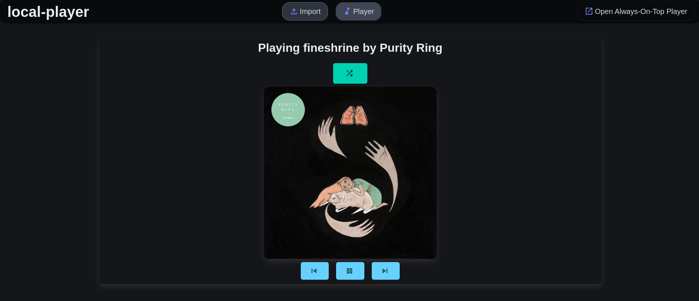
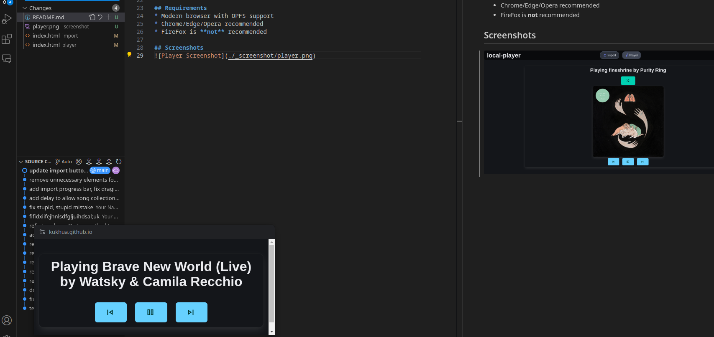

# Local Music Player

Browser-based music player designed to store and play your personal music collection directly in the browser. 
With metadata extraction and synced lyrics, it transforms your audio files into a fully-featured music experience right in the browser.

## Features
* Display album art and metadata
* Always-on-top miniplayer mode
* Media key support
* Track history with previous/next navigation
* Shuffle playback
* Drag & drop file import
* Automatically fetch lyrics via [LRCLIB API](https://lrclib.net/)

## Technical Details
* Built with vanilla JavaScript, CSS & HTML
* Stores music in Origin Private File System (OPFS)
* Supports common audio formats (MP3, WAV, OGG, FLAC)

### Libraries
 * [Bluma](https://bulma.io/) - [MIT](https://opensource.org/license/mit)
 * [JSMediaTags](https://github.com/aadsm/jsmediatags) - [BSD](https://github.com/aadsm/jsmediatags?tab=License-1-ov-file)

## Requirements
* Modern browser with OPFS support
* Chrome/Edge/Opera recommended
* FireFox is **not** recommended

## Screenshots

